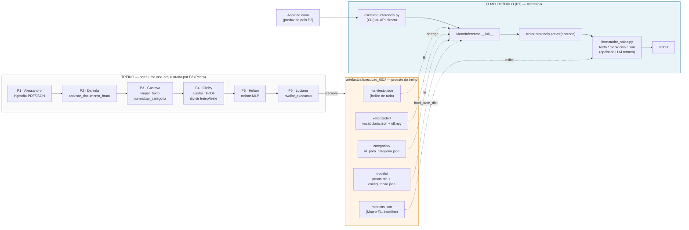
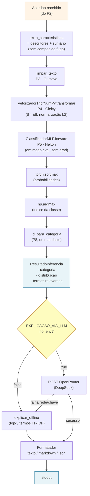

# Entrega P7 — MotorInferencia

**Autor:** Sandro Tarabay
**Data:** 2026-06-15
**Versão:** 1.3
**Domínio:** D07 — Inferência e explicação (SCRUM-11)
**Fase:** 1 (entrega) — inclui a vertente *Could Have* (LLM) e exibição de métricas do treino (P6)

## Propósito

Dado um `id_execucao` e um `Acordao`, prever uma de cinco categorias
(`MANTIDA`, `REVOGADA`, `ANULADA`, `NAO_CONHECIDA`, `OUTRA`) reconstruindo o
vetorizador e o modelo pelo `manifesto.json`, usando a mesma composição de
entrada do treino (sem train/serve skew). Explicação opcional, offline ou via
LLM remoto, sempre marcada como "não constitui aconselhamento jurídico".

## Diagrama macro — posicionamento no projecto



## Diagrama micro — fluxo interno



## Contratos

**Construtor:** `MotorInferencia(id_execucao: str, pasta_artefactos: str | Path = "artefactos")`

**Método:** `.prever(acordao: Acordao, com_explicacao: bool = False) -> ResultadoInferencia`

**Resultado:**

```python
@dataclass
class ResultadoInferencia:
    categoria_prevista: str        # uma das 5 classes ADR-05
    indice_previsto: int           # 0–4
    distribuicao: dict[str, float] # softmax; soma ≈ 1
    termos_relevantes: list[str]   # top-5 por peso TF-IDF
    excerto_sumario: str           # ≤ 400 caracteres
    explicacao_gerada: str | None
```

## Dependências de outros módulos

| Origem | Como é consumido |
|---|---|
| P2 · `Acordao` | Recebido como parâmetro — quem chama é responsável pela origem |
| P3 · `limpar_texto` | Import directo |
| P4 · `VetorizadorTfidfNumPy` | Import directo + `.carregar()` do disco |
| P5 · `ClassificadorMLP` | Import directo + `state_dict` |
| P8 · `manifesto.json` | `ler_manifesto(id_execucao, pasta_artefactos)` |
| P6 · `metricas.json` | Leitura passiva do JSON; sem chamada a funções |

## Ficheiros a integrar (PR para o repo da equipa)

```
src/inferencia/
├── motor_inferencia.py
├── executar_inferencia.py
├── formatador_saida.py
└── configuracao_gpu.py

tests/
├── test_motor_inferencia.py
├── test_executar_inferencia.py
└── test_formatador_saida.py

docs/
└── entrega_p7_inferencia.md
```

## Comandos

```bash
# Instalação
pip install -e .
cp .env.exemplo .env       # ajustar ID_EXECUCAO e chaves opcionais

# Testes
python -m unittest discover -s tests -p "test_*.py"

# Inferência (ficheiro único)
python -m src.inferencia.executar_inferencia \
    --ficheiro-json data/ECLI_PT_STA_1950_000578_FF.json

# Inferência (pasta inteira)
python -m src.inferencia.executar_inferencia --pasta-dados data/

# Layout / LLM por variável de ambiente
FORMATO_SAIDA=markdown python -m src.inferencia.executar_inferencia ...
EXPLICACAO_VIA_LLM=true python -m src.inferencia.executar_inferencia ...
```

## Variáveis `.env`

| Variável | Default | Função |
|---|---|---|
| `ID_EXECUCAO` | `execucao_teste` | Subpasta de `artefactos/` a carregar |
| `PASTA_ARTEFACTOS` | `artefactos` | Pasta-mãe das execuções |
| `PASTA_DADOS` | `data` | Pasta com os JSONs a inferir |
| `FORMATO_SAIDA` | `texto` | `texto` / `markdown` / `json` |
| `EXPLICACAO_VIA_LLM` | `false` | Activa LLM remoto (Could Have) |
| `DEEPSEEK_URL_BASE` | `https://openrouter.ai` | Endpoint OpenRouter |
| `DEEPSEEK_MODELO` | `deepseek/deepseek-v4-flash` | Modelo OpenRouter |
| `DEEPSEEK_CHAVE_API` | — | Chave; **nunca commitar** |
| `LLM_TEMPO_LIMITE_SEGUNDOS` | `20` | Timeout do LLM |
| `GPU_HABILITADA` | `false` | Activa GPU NVIDIA |
| `GPU_NUM_DISPOSITIVOS` | `1` | 1, 2 ou 3 |
| `GPU_DISPOSITIVOS` | `auto` | `auto` / `"0"` / `"0,1"` / `"0,1,2"` |

## Pedido ao integrador (P8 — Pedro)

**`requirements.txt`** — acrescentar:

```
requests>=2.31.0    # P7 — LLM opcional (Could Have)
```

**`.env.exemplo`** — acrescentar as 12 variáveis da tabela acima.

**`pyproject.toml`** — opcional, para entry-points:

```toml
[project.scripts]
jurimetria-inferir = "src.inferencia.executar_inferencia:principal"
```

## Garantias verificadas

- **Anti-leakage** (teste programático): dois `Acordao` com mesmos descritores+sumário mas `ecli`/`tribunal`/`decisao_bruta`/`texto_integral` distintos produzem a mesma previsão.
- **Determinismo**: mesmo input → mesmo output; `semente=42`.
- **LLM offline-first** (ADR-03): desligado por defeito; sem chave cai para offline; nunca envia campos de fuga.
- **TF-IDF em NumPy** (ADR-01): zero `sklearn` na vetorização.
- **Multi-GPU** opcional (1/2/3) via `.env`; defaults para CPU.
- **`pyproject.toml`** com `setuptools.build_meta` (compatível com setuptools ≥ 40).

## Limitações

- Modelo do scaffolding **não treinado** (pesos aleatórios) — valida canalização, não qualidade. Substituído pela execução real do P5/P8.
- `limpar_texto` da entrega é versão base; no repo da equipa o P7 usa a versão canónica do P3 (mesmo path, sem alteração de código).
- LLM sem chave → cai para offline silenciosamente.
- Para inferência, `DataParallel` em 3 GPUs traz overhead; recomendado 1 GPU. Para treino (Fase 2), considerar `DistributedDataParallel`.

## Checklist

- [x] Nomes em `snake_case`/`PascalCase` (pt-PT)
- [x] Type hints completos; `mypy --strict` limpo
- [x] `ruff` limpo
- [x] Ausência de data leakage testada
- [x] Carregamento exclusivamente pelo `manifesto.json`
- [x] `semente=42`; `logging` em vez de `print`
- [x] 56 testes; só dados sintéticos
- [x] LLM offline-first; fallback silencioso
- [x] Multi-GPU opcional
- [x] Exibição informativa das métricas (P6) — leitura passiva
- [x] `pyproject.toml` válido; entry-points registados
